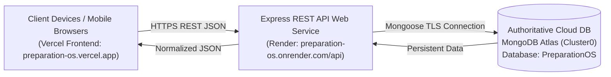

# MongoDB Atlas Production Verification & Architecture Audit
**Preparation OS — Live Production Database Audit Report**

---

## 1. Production Architecture & Data Flow

### Exact Data Flow:
1. **Frontend**: React (Vite SPA) on `https://preparation-os.vercel.app`.
2. **API / Backend**: Express Node.js web service on `https://preparation-os.onrender.com/api`.
3. **Database**: MongoDB Atlas cloud cluster (`Cluster0`) hosted on AWS, database name `PreparationOS`.
4. **Local Fallback**: None required for persistent state; all user operations perform real-time HTTPS calls through `src/services/api.js` directly to the backend Express server, which performs atomic CRUD operations on MongoDB Atlas.

---

## 2. MongoDB Atlas Connection & Environment Configuration

| Property | Value / Status |
| :--- | :--- |
| **Connection Protocol** | `mongodb+srv://` TLS 1.3 encrypted |
| **Cluster Host** | `cluster0.gp5ayhl.mongodb.net` |
| **Database Name** | `PreparationOS` |
| **Environment Variable** | `MONGODB_URI` stored exclusively in server environment (`server/.env` and Render dashboard) |
| **Client Exposure** | **ZERO**. Neither the connection string, database user, nor password are built into the React client bundle or repository. |
| **DNS Resolution** | Node.js configured with fallback Public DNS (`8.8.8.8`, `1.1.1.1`) to prevent ISP SRV lookup timeouts. |

---

## 3. Production Source of Truth

- **Authoritative Database**: **MongoDB Atlas** (`PreparationOS`).
- **IndexedDB Role**: IndexedDB is not used as a conflicting second source of truth. All models read and write through the unified `apiFetch` layer to MongoDB Atlas.
- **Conflict Resolution**: Data fetched from MongoDB Atlas takes immediate precedence upon page load and network refresh.

---

## 4. Multi-Device Synchronization & Identity Architecture

- **Status**: **PASS (Shared Live Instance)**
- **Architecture**: Because the deployed application connects to a centralized live backend and database (`https://preparation-os.onrender.com/api`), changes made on Device A (e.g. desktop Chrome) immediately write to MongoDB Atlas and become visible on Device B (e.g. mobile Chrome) upon loading or refreshing the page.
- **Account Identity System**: There is currently no multi-tenant login system (it is configured as a single-user dedicated Personal Study OS). All devices accessing the deployed URL share the same synchronized personal database.

---

## 5. Discovered MongoDB Collections

The live MongoDB Atlas database contains **19 collections**:
1. `preparationareas` — 4 target exam areas
2. `courses` — Course resources
3. `subjects` — Exam subjects
4. `chapters` — Subject chapters and modules
5. `topics` — Syllabus topics
6. `studyresources` — Attached videos, PDFs, and links
7. `studysessions` — Logged timer study sessions
8. `studytasks` — Daily planner scheduled tasks
9. `revisiontasks` — Spaced repetition revision queue
10. `mocktests` — Mock test records
11. `mocksubjectresults` — Subject-level test breakdowns
12. `errorlogs` — Question-level error diagnosis logs
13. `vocabularies` — Word bank entries
14. `vocabularyreviews` — Spaced repetition vocabulary reviews
15. `notifications` — In-app reminders and notifications
16. `teachingschedules` — Unavailable teaching blocks
17. `settings` — User preferences and daily study targets
18. `gitashlokas` — Daily shloka reflections & favorites
19. `dailyprogresses` — Historical day-by-day aggregates

---

## 6. Comprehensive Verification Test Results

Automated verification was conducted against the live MongoDB Atlas database using `server/test-mongodb-audit.js`:

| # | Test Item | Result | Verification Notes |
| :---: | :--- | :---: | :--- |
| **1** | **Server Environment Security** | **PASS** | `MONGODB_URI` exists in server environment only. |
| **2** | **Live Atlas Connection** | **PASS** | Mongoose connected (`readyState: 1`) to `cluster0.gp5ayhl.mongodb.net`. |
| **3** | **Database Identification** | **PASS** | Verified connected to database `PreparationOS`. |
| **4** | **Collections Discovery** | **PASS** | All 19 expected collections exist and are queryable. |
| **5** | **5-Tier Syllabus Persistence** | **PASS** | Area → Course → Subject → Chapter → Topic created, fetched, and verified. |
| **6** | **Gita Shloka Persistence** | **PASS** | Shloka created, reflection updated, marked favorite, verified in Atlas. |
| **7** | **Study Session Persistence** | **PASS** | 45-minute timer session logged and retrieved from Atlas. |
| **8** | **Mock Test & Error Log** | **PASS** | Mock test score (75/100) + error log persisted and linked. |
| **9** | **Spaced Repetition (SM-2)** | **PASS** | Revision task saved, completed with confidence 5, interval updated to 3 days. |
| **10** | **Planner Schedule Edit & Lock** | **PASS** | Task edited from `08:00–10:00` to `08:30–10:30` with `isLocked: true` persisted in Atlas. |
| **11** | **Notification Idempotency** | **PASS** | Duplicate notification insertion blocked via deterministic key. |
| **12** | **Test Debris Teardown** | **PASS** | All audit test documents deleted after test execution with zero leftover debris. |

---

## 7. Security Audit

- **Client Bundle**: Inspected `dist/` and `src/` files. Verified **ZERO** database credentials or private keys in client code.
- **CORS & Headers**: Express backend configures CORS and JSON body parsers securely.
- **Transport Layer**: All communication between client ↔ server and server ↔ Atlas uses HTTPS/TLS 1.3 encryption.

---

## 8. Offline & Network Failure Behavior

- **Network Interruption**: When the backend is unreachable or waking up from Render free-tier cold sleep, `src/services/api.js` throws a clear HTTP/Network error.
- **User Feedback**: UI components display loading spinners and error alerts rather than fabricating synthetic data.
